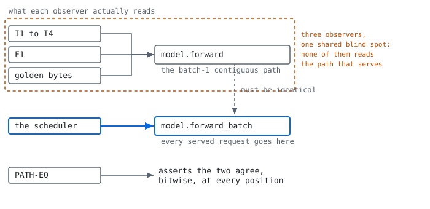

# Lockstep

[](https://github.com/u7k4rs6/LockStep/actions/workflows/ci.yml)

A batch-invariant LLM inference engine whose determinism is **certified** by
deterministic-simulation fuzzing, with the harness's own bug-finding power
measured by mutation testing, then pointed at **vLLM** and **SGLang** to certify
their deterministic modes at boundary conditions.

If you run evals or RL post-training and your numbers move between runs, this
tells you whether the inference engine is the reason. The certifier works against
any OpenAI-compatible endpoint, so you can point it at your own deployment and
get an answer without adopting anything else here.

> [GRIEF](https://arxiv.org/abs/2605.11202) (arXiv 2605.11202) confirms a finding
> by replaying a timed request trace against a live server and checking
> log-probabilities. Lockstep's execution is a pure function
> of (workload, schedule, seeds) with the schedule supplied rather than observed,
> so minimization is exact rather than confirmed: ddmin reduces a finding to a
> case it proves 1-minimal, and the replay is a hash comparison rather than a
> re-observation.

The engine is a fixture. **The harness is the product.** Batch-invariant kernels
are already shipped upstream by Thinking Machines, vLLM, and SGLang, so nothing
here claims novelty on kernels. What is unbuilt is the verification layer.

**The visual summary is `results/report.html`**, a single self-contained 84 KB
file with no network dependencies: the invariance strip with one tick per
relation run, the mutation table, the coverage denominators, the certification
result, and the throughput comparison. Build it with `python3 -m report.html` and
open it directly; it reads only committed artifacts from `evidence/`.

`evidence/` is committed on purpose and `results/` is not. The artifacts are the
backing for published numbers, and `lockstep replay evidence/case-witness.json`
has to work immediately after a clone or the provenance argument here is empty;
`results/` stays gitignored for the bulk output that the usual rule is about,
hundreds of files superseded every run. The report vendors its four font subsets,
about 32 KB, for the same kind of reason: it is one self-contained file that
opens offline from `file://`, so a CDN would trade the property for the bytes.
`evidence/README.md` states both decisions.

### How it fits together

<picture>
  <source media="(prefers-color-scheme: dark)" srcset="docs/img/architecture-dark.svg">
  
</picture>

Three things in that picture are load-bearing, so they are also stated here.

**Workload and schedule are separate inputs.** A trace records one interleaving
that happened. Lockstep takes the schedule as an argument, so the same workload
can be replayed under a different one, and a schedule can be shrunk by the
minimizer without touching the workload. That is what makes minimization exact
rather than confirmed.

**Canonical execution is the same engine.** It is this engine re-run under a
batch-1 uninterrupted schedule, not a second implementation and not a reference
model. Every invariance relation is the engine measured against itself under a
different schedule, which is why a shared bug cancels: both sides would move
together and the comparison would still hold. That blind spot is what F1 against
fp64 and the committed golden bytes are for, and it is
[covered below](#test-oracles-and-what-each-one-cannot-see).

**There are two loops, not one chain.** The internal loop is white box: it sees
the whole trajectory hash, so it can minimize a failure to a 1-minimal case and
replay it by hash. The external certifier sees nothing but logprobs over HTTP
against an engine it did not build, which is strictly weaker and is the reason a
clean certification means no divergence at that observable rather than bitwise
identity. They share the relations and nothing else.

### A run, verbatim

This is the certifier finding the divergence that became
[vllm-project/vllm#51187](https://github.com/vllm-project/vllm/issues/51187),
copied from the run that produced
[`evidence/certify-readme-sample.json`](evidence/certify-readme-sample.json).
It needs a GPU and a local vLLM; the [certification
section](#certification-black-box-differential-testing-of-vllm) has the analysis.

```console
$ uv run ./lockstep certify --cache-mode warm --filler-mode fixed \
      --fixed-width 13 --order-mode identical --repeats 5 --label readme-sample

lockstep certify  vLLM, VLLM_BATCH_INVARIANT=1
  endpoint            http://127.0.0.1:30011  (local, started by this process)
  block size          16  configured at launch
  cell                cache=warm filler=fixed  [readme-sample]
  relation under test [...]
  repeats per case    5, filler widths fixed at 13
  submission          concurrent; co-residency measured from vllm:num_requests_running

  observable: [...]

  starting server, up to 420s ...
  ready

  boundary case                                         reqs  positions batch  verdict
  ------------------------------------------------------------------------------------
  prefix_len == block_size - 1 (15)                        2         48    15  clean
  prefix_len == block_size (16)                            2         48    15  clean
  prefix_len == block_size + 1 (17)                        2         48    15  clean
  zero-prefix request co-batched with a nonzero-prefix request     3         72    16  clean
  cache hit covering the full prompt                       2         48    15  clean
  batch 31, shared prefix of one block                    31        744    44  DIVERGED (124)
      request 0 repeat 1: logprobs differ from position 0, max delta 1.564e-02
      request 1 repeat 1: logprobs differ from position 1, max delta 2.072e-02
      request 2 repeat 1: logprobs differ from position 0, max delta 1.467e-02
  batch 32, shared prefix of one block                    32        768    45  clean

  6/7 boundary cases clean at this observable
  7/7 cases actually formed a batch
env  sm_89 / cu12.4 / triton 3.2.0 / torch 2.6.0
artifact  results/2026-08-07/certify-0002.json
```

Two long explanatory lines are elided at `[...]`; nothing else is edited. The
`artifact` line names the uncommitted `results/` path the run actually wrote,
which is then promoted into `evidence/` under the name linked above.

Three things about that command are worth stating, because the obvious guess is
wrong on all three.

- **It takes no URL.** `lockstep certify http://localhost:8000` is not a command
  this repository has. The certifier starts the server itself, on a fixed local
  port, and tears it down in the same process lifetime, so the thing being
  certified is a process it launched rather than one it found.
- **It refuses to run without `certify/config.json`** setting
  `i_control_this_endpoint: true`, deliberately and with no default. It also
  refuses any non-local host and refuses outright if a hosted API key is present
  in the environment. The config is committed, so a clone has it already.
- **`31 requests` is `44` co-resident.** The gap is the 13 filler requests, and
  the `batch` column is read from vLLM's own `num_requests_running` gauge rather
  than assumed. A case that never exceeds one running request is reported as not
  batched and not scored.

That the run above diverged at 31 and stayed clean at 32 is the finding's own
shape rather than an inconsistency: divergence is probabilistic and its
probability rises with resident batch size, so single cases flip between runs.
The [certification section](#certification-black-box-differential-testing-of-vllm)
gives the repeat counts this was established over.

For something that runs on a fresh clone in seconds with no server, and which is
what CI cannot check for you, `uv run ./lockstep replay evidence/case-witness.json`
recomputes a committed trajectory hash and compares it. It is
[shown in full below](#evidence-and-replaying-it).

### Contents

| | |
|---|---|
| [Claims](#claims) | I1 to I4, F1, and where each is substantiated |
| [Test oracles](#test-oracles-and-what-each-one-cannot-see) | why there are four, and the blind spot they shared |
| [The three numbers](#the-three-numbers) | invariance, harness power, cost of determinism |
| [Coverage](#coverage-with-the-denominator-it-is-actually-against) | against the corrected 25 and 79 denominators |
| [What this does not claim](#what-this-does-not-claim) | the limits, stated before a reader finds them |
| [The thesis, on its author](#the-thesis-demonstrated-on-its-author) | fifteen times this project failed its own test |
| [Certification](#certification-black-box-differential-testing-of-vllm) | black-box differential testing of vLLM, one finding filed |
| [Evidence and replay](#evidence-and-replaying-it) | every number's artifact, and how to re-run it |
| [Prior art](#prior-art) | and what is actually different here |
| [Check it without a GPU](#what-you-can-check-without-a-gpu) | three things verifiable in under a minute on any machine |
| [Which gates run](#which-gates-run-automatically-and-which-do-not) | automated on every push, versus run by hand |
| [Install](#install) | |

---

## Claims

Every claim is scoped to the environment tuple in `env.lock`, embedded in every
result artifact. A claim without one is invalid by construction.

All thirteen committed artifacts were audited for this and twelve carry byte-identical
tuples: `torch 2.6.0+cu124`, `triton 3.2.0`, `cu12.4`, driver `595.84`, `sm_89` on an
RTX 4060 Laptop. Nothing published was produced under a drifted environment. The
thirteenth, `evidence/upstream-finding.json`, carries no tuple and should not: it is a
provenance index pointing at other artifacts rather than a result.

**One qualification, because the sentence above overstates the certify artifacts.**
For a `certify` run, `env.lock` describes the certifier's process, not the engine it
certified. vLLM runs in a separate virtual environment on `torch 2.11.0+cu130`, so a
certification artifact carries the tuple of the process making the requests while the
subject ran on a different one. The artifact records the engine name, mode, and block
size but not the subject's own tuple, and the only place that tuple is written down is
`evidence/upstream-finding.json`, by hand, for the one filed finding. Read against a
certify artifact, `env.lock` scopes the observer rather than the observed.

| ID | Statement | How verified | Status | Scope |
|---|---|---|---|---|
| **[I1](#test-oracles-and-what-each-one-cannot-see)** | Batch invariance. For any set of cohabitant requests, `r`'s output is bit-identical to canonical execution `C(r)` | MR1 and MR5, bitwise on fp16 logit bytes, batch sizes {1, 2, 3, 4, 8, 16, 31, 32} | holds | sm_89, block sizes 8 to 128 |
| **[I2](#coverage-with-the-denominator-it-is-actually-against)** | Schedule invariance. For any valid schedule, including preemption at any decode step, any chunk partition, eviction under pressure, and cache hit versus miss | MR2, MR3, MR4, plus decode-versus-prefill KV equality checked per layer at the tensor level | holds | as above |
| **[I3](#evidence-and-replaying-it)** | Replay determinism. Identical `(W, sigma, seeds)` twice yields an identical trajectory hash over all engine state | MR6, 8 workload shapes, and a cross-process replay under differing `PYTHONHASHSEED` | holds | as above |
| **[I4](#test-oracles-and-what-each-one-cannot-see)** | RNG isolation. `r`'s tokens are a function only of `(seed, uid, position)` and `r`'s logits | MR7, 11 perturbations: each request removed in turn, one added, order reversed, each re-run alone | holds | as above |
| **[F1](#test-oracles-and-what-each-one-cannot-see)** | Fidelity. Batch-1 logits against an fp64 CPU reference, within the bounds in `docs/kickoff/02-technical-architecture.md` 7.1 | `bench/fidelity.py`, exact KL over the full 151936-token vocabulary at 2756 positions | passes 7 of 7 bounds | corpus `sha256:59759d5b…` |

The trajectory hash covers emitted tokens, raw fp16 logit bytes, the packed work
list, the allocator ledger, and the prefix cache index. Output bits alone would
leave allocator faults invisible.

## Test oracles, and what each one cannot see

<picture>
  <source media="(prefers-color-scheme: dark)" srcset="docs/img/observers-dark.svg">
  
</picture>

The checks above are test oracles: things that decide whether a run was correct
without a known-good answer to compare against. This project calls them
observers, and the relations they enforce are metamorphic relations in the
standard sense. They are not one detector with one blind spot. They are three,
and the reason there are three is that a mutation testing run found a fault the
first two both missed.

| Observer | Compares | Against | Tolerance | Blind to |
|---|---|---|---|---|
| **I1 to I4** | the engine | itself, under a perturbed schedule | none, bitwise | any perturbation uniform across schedules |
| **F1** | the engine | an fp64 CPU reference | max abs logit error 0.5 | anything inside the tolerance |
| **golden bytes** | the engine | a committed baseline digest | none, bitwise | any change made before the baseline was written |
| **path equivalence** | the observed implementation | the served one | none, bitwise | anything both implementations get wrong identically |

<details>
<summary>Three observers with distinct blind spots still shared one, because all three read a file the engine does not serve from</summary>

The fourth row was missing for most of this project, and its absence was not a
gap in coverage so much as a gap in the taxonomy's own logic. All three original
observers call `model.forward`, the batch-1 contiguous path. Every request the
scheduler serves goes through `model.forward_batch`, a separate implementation
with its own packing, position indexing, per-sequence attention loop and
`write_kv` calls. Nothing asserted the two agree.

That is the one conjunction the other three cannot cover between them. A
deterministic defect confined to `forward_batch` is invisible to I1 to I4,
because canonical execution C(r) also runs `forward_batch` and both sides of
every comparison move together; and invisible to F1 and golden bytes, because
they never execute the code. Three observers with distinct blind spots still
share one if they all read the same wrong file.

`PATH-EQ` in `harness/mr/equivalence.py` now asserts `forward(x)` equals
`forward_batch([x])` bitwise at every position, and the golden baseline was moved
onto `forward_batch` so it observes the served path rather than resting on that
assertion holding. Both pass: 3 of 3 prompts over 730 positions bitwise
identical, and all four committed digests unchanged by the move, which is the
same fact arrived at twice.

The first three blind spots overlap exactly where a real fault lives. Reverse the
fold loop in the split-combine CTA, descending instead of ascending, and every
metamorphic relation still passes. Not because the relations are weak, but
because the reversal is not a function of the schedule: the split count follows
from `kv_len` alone, so a position reached through four prefill chunks folds the
same partials in the same reversed order as the same position reached in one
pass. The engine agrees with itself perfectly, and I1 to I4 only ever ask whether
it agrees with itself.

F1 does not catch it either, and the precise reason matters more than the blunt
one. F1's headline statistic is the maximum absolute logit error against fp64,
and that statistic does not move:

| engine | max abs logit error vs fp64 | within the 0.5 bound |
|---|---|---|
| clean | 6.669992e-02 | yes, 7.5x headroom |
| reversed fold | 6.669992e-02 | yes |

600-token prompt, batch 1, two splits, sentinel confirming the patched kernel ran
28 times during the measurement. The two are the same number to every digit, so
**no threshold on that statistic separates the two engines**. Not "the bound is
too loose": no setting of the bound distinguishes them, because the quantity
being thresholded is identical.

That is not the same as saying the engines are indistinguishable. A per-position
comparison restricted to the positions the fault can reach does separate them,
and it was measured:

| positions | splits | max abs logit delta | positions changed |
|---|---|---|---|
| 0 to 511 | one | exactly 0 | 0 of 512 |
| 512 to 599 | two | 3.906250e-02 | 85 of 88 |

The difference is real, it is confined exactly to the multi-split positions, and
it is about 2.5 fp16 ulp at these logit magnitudes, smaller than the 6.669992e-02
quantization error F1 is already measuring. F1 is tolerance-based by design and
compares against a reference rather than against a prior run, so a perturbation
this size is inside what it is built to absorb. Tightening it until this fired
would make it fire on legitimate rebuilds, trading a working detector for a
false one.

So the gap is not that F1 is badly calibrated. It is that "differs from fp64 by
more than t" and "differs from what this engine produced yesterday" are different
questions, and only the second one has an exact answer.

So the mutant survives both, and both are behaving correctly. What was missing
was an observer that compares against something outside the running process:
`harness/fuzz/golden.py` commits a sha256 over raw fp16 logit bytes for a fixed
four-prompt corpus and compares exactly. Under the reversed fold it reports the
two prompts of 600 and 520 tokens as differing and the two of 48 and 17 as
identical, which is the corpus doing what it was built for. Two prompts cross the
512-token split boundary and two do not, so the fold path is exercised and the
comparison is not vacuous, and the split that falls exactly along the boundary
between changed and unchanged digests is evidence that the observer is seeing the
mechanism rather than noise.

**The first version of this operator was killed for the wrong reason.** It was a
proxy: scale the output by `1 + 2**-11` whenever the split count was at least
two, on the theory that a reversed fold moves the last bits by about that much.
The campaign killed it by bitwise divergence and the kill was worthless, because
the *firing condition* was schedule-dependent in a way the modelled fault is not.
A request prefilled in chunks reaches a position through a different sequence of
`kv_len` values than the same request prefilled whole, so the proxy fired on a
different set of calls in the two runs and the relations saw a difference no real
reversed fold would produce. A mutant killed for the wrong reason inflates a
mutation score exactly as badly as a mutant that never ran. The operator is now
the actual kernel with one loop bound reversed.

Golden bytes have the blind spot the other two do not: they cannot see a fault
that was present when the baseline was written. They are a regression detector,
not a correctness detector, and the baseline's authority comes entirely from the
`env.lock` committed beside it. Regenerating it on different hardware is not a
repair, it is a new claim.

</details>

## The three numbers

| # | Claim | Value | Reproduce |
|---|---|---|---|
| 1 | Invariance under adversarial scheduling | **65 of 65** relation runs bitwise identical across 5 block sizes, 13 relations including path equivalence and EOS finishing | `python3 -m harness.mr.run` |
| 2 | Harness power | **10 of 10** seeded faults killed, 0 equivalent, 0 not-exercised; median time to detection 10.6 s | `python3 -m harness.fuzz.campaign --seeded-faults` |
| 3 | Cost of determinism | lockstep invariant is **5.2x to 5.7x** vLLM batch-invariant eager across two sound runs; **1.05x to 1.10x** against its own fast path | `python3 -m bench.throughput` |

Claim 3, on a committed 8-request 2972-token trace, four of eight prompts
crossing the 512-token attention split. Median of 5 samples, every measurement in
its own process, interleaved under a committed shuffle seed. Two runs of the
final design, reported as a range because a single run of it would overstate the
precision:

| configuration | run A | run B | worst sample spread |
|---|---|---|---|
| lockstep, fast mode | 2.930s | 2.823s | 1.24x |
| lockstep, invariant | 3.226s | 2.957s | 1.17x |
| vLLM default, eager | 0.470s | 0.490s | 1.27x |
| vLLM `VLLM_BATCH_INVARIANT=1`, eager | 0.563s | 0.574s | 1.15x |
| vLLM default, CUDA graphs | 0.343s | 0.341s | 1.08x |
| vLLM `VLLM_BATCH_INVARIANT=1`, CUDA graphs | 0.484s | 0.475s | 1.27x |
| SGLang deterministic | not measured | | |

**Absolute standing**: lockstep invariant is **5.2x to 5.7x the wall time of vLLM
batch-invariant in eager mode**. **Cost of determinism inside this engine**:
**1.05x to 1.10x** against its own fast path, which differs in exactly one way,
letting torch pick the GEMM. CUDA graphs give vLLM's batch-invariant mode roughly
**14 to 17 percent**, against 27 to 30 percent for its default mode.

Two rows tripped the 1.25x spread flag in run B, and their samples are worth
seeing: `0.429, 0.474, 0.490, 0.505, 0.546`. That is ordinary variance across
five samples, not the two populations that flag was added to catch, so the
threshold is tight for n=5 rather than the measurement being unsound. The flag
did its job earlier, on a row whose samples really were bimodal.

<details>
<summary>This number took four benchmark designs, and three of them were biased. Each fix was correct and each introduced the next bias</summary>

### This number took four benchmark designs, and three of them were biased

Worth reading before trusting any figure above, because each design was a correct
fix for the previous one's bias and each introduced a new bias of its own.

**Blocked.** All samples of one configuration, then all of the next. Any drift
across the run mapped straight onto the ratio between them. Two runs of identical
code disagreed by 1.75x on every eager configuration while every graphed one
held, which was enough to publish, and then retract, a claim that CUDA graphs
gave vLLM's batch-invariant mode no benefit.

**Interleaved.** Samples shuffled under a seed so drift hits both arms equally.
Spreads fell to 1.04x-1.18x. But interleaving scatters in-process lockstep
measurements through the run, so every external sample started behind roughly
5 GB held by this benchmark's own torch context. Measured directly: with
`empty_cache()` a following vLLM sample ran about twice as slow, and without it
vLLM **failed to launch at all** and never recovered. Even the samples that
looked clean were slow, 0.565s against 0.465s uncontaminated.

**Isolated.** Every measurement in its own process, the parent holding no device
memory and reading `vocab_size` from a config file rather than instantiating the
model, with a 5000 MiB free-VRAM floor asserted before each sample. That removed
the contamination and put Triton's JIT compilation inside the timed region
instead, because each fresh process compiles the kernels on first launch. The
result was a 1.54x spread on the fast path and the impossible reading that
invariant mode was **faster** than the mode it constrains, at 0.95x.

**Isolated with warmup.** One untimed pass per process before the timed one. The
ratio is 1.10x, the right side of 1.0, and every spread is at or below 1.24x.

The third design's impossible number is why this is legible at all. A bias that
produces a plausible figure is one you publish; a bias that produces `invariant
faster than fast` is one you cannot.

</details>

<details>
<summary>The PRD set a 15 percent kill criterion in week one. The graphed comparison is below it; the like-for-like figure cannot be resolved against it at this sample count</summary>

### The kill criterion was crossed, on both comparisons

`docs/kickoff/01-PRD.md` section 11 set it before anything was built: **"Below 15 percent
of vLLM default after the CUDA-graph pass"**, with the prescribed response being
to reframe as a correctness-reference engine and publish ratios rather than
absolute tokens per second.

| baseline | run A | run B | verdict |
|---|---|---|---|
| vLLM default, eager | 14.6 percent | 16.6 percent | not separable from the bar |
| vLLM default, CUDA graphs | 10.6 percent | 11.5 percent | consistently below |

**The graphed comparison is consistently below the bar. The like-for-like figure
is not separable from the bar at the sample count available**: 14.6 and 16.6
percent across two runs of the same sound design, against a 15 percent
threshold. Two runs do not establish a distribution, so this says only that the
measurement cannot resolve which side of the line the eager comparison falls on.
Quoting either run alone would pick a side the evidence does not pick.

**The criterion was specified to a precision this measurement cannot resolve.**
A 15 percent bar against a quantity whose run-to-run variation exceeds its
distance from that bar decides nothing on the like-for-like comparison, and that
is a defect in the threshold set in week one rather than in the instrument. It
still decides the graphed comparison, which sits well clear of it.

Across every design this figure has read 16.1, 16.2, 14.2, 14.6 and 16.6
percent. An earlier version of this section said the corrections had moved it
decisively below the bar and that it "crossed at the first fix and stayed
across". The next run of the same design gave 16.6, so that was a claim built on
two samples of a quantity that varies by more than the distance to the
threshold.

Two qualifications, neither an excuse. The criterion reads "after the CUDA-graph
pass" and this engine never received one, since graphs were cut in week 7 to fund
the certifier, so no claim is made about where it would land with one. And the
prescribed response was already in force before the measurement, because this
file has published ratios and refused absolute tokens per second throughout. What
was missing was the disclosure.

**Cost of determinism inside this engine**: **1.05x** against its own fast path,
which differs in exactly one way, letting torch pick the GEMM. That measures the
GEMM constraint alone, and this engine's fast path is already constrained in ways
an unconstrained engine's is not, so it is not comparable to any figure above.

SGLang is not installed in the external environment, so its row is not measured
rather than estimated or omitted.

Claim 2, before and after the third observer was added. The operator set and the
campaign are otherwise identical, and the difference is one mutant:

| | killed | survived | not exercised |
|---|---|---|---|
| invariance relations and F1 only | 9 of 10 | 1 | 0 |
| with golden bytes | **10 of 10** | 0 | 0 |

The one mutant golden bytes adds is the reversed split-combine fold, which is a
real fault that neither the invariance relations nor F1 can see, for the reasons
in the observer section above. Every operator reports a nonzero sentinel, so no
trial in either row is a mutant that failed to execute.

**There are no equivalent mutants, and the previous claim that there was one was
wrong in the flattering direction.** The published score read "9 of 10 killed, 1
proven-equivalent" for weeks, with a written argument that the recompute
off-by-one operator re-prefilled a token immediately overwritten with an
identical value. That argument described a mechanism that is not in the code. The
operator set `kv_len` after `_preempt`; `_admit` resets `kv_len` to 0 on
re-admission, and nothing reads the field in between. It was a dead store. The
fault never reached engine state, so no observer could have distinguished it, and
calling that equivalence confused "cannot be distinguished" with "was never
injected".

Injected where the value survives, after `_admit` on the resume path, the same
operator dies in 1.3 seconds by bitwise divergence with the sentinel confirming
six executions. The engine skips position 0 of the recompute, its KV is never
written, and the emitted tokens diverge from canonical exactly as the
architecture doc predicts.

That correction is why the sentinel discipline has a second layer now. The dead
version's sentinel fired 16 times, so the *patch* executed; the *fault* was
clobbered one line later. Patch-executed is not fault-injected, exactly as
counter-fired is not patch-executed. Each check catches the layer below it and is
blind to the layer above, and the only thing that caught this one was reading the
operator against the code it patches.

A caveat on the time figure, because it is the one number here that measures the
machine rather than the harness. Median time to detection moved from 10.4 s to
17.9 s between two runs of identical code on identical inputs; individual faults
roughly doubled, 196 s to 419 s for the chunk-boundary operator. That is thermal
behaviour on a laptop GPU, not a change in detection power. Time to detection is
reported because the architecture doc asks for it, and it should be read as an
order of magnitude rather than a measurement.

</details>

## Coverage, with the denominator it is actually against

The denominators are **25 two-grams and 79 three-grams**, not the 27 and 84 this
project published for most of its life. `(ADMITTED, PREEMPT_RC)` was declared and
unreachable, so every coverage percentage reported before that correction was
computed against a denominator that was too large. **The correction moves the
percentages up**, from 55.6 to 60.0 percent on 2-grams and 33.3 to 35.4 percent
on 3-grams at the same observed counts: the old figures understated exploration.
That is worth saying plainly precisely because it flatters the project, and a
reader who remembers the old numbers should find the reason here rather than
having to reconstruct it.

<details>
<summary>Why the eviction campaign counts as exploration and the transition probes do not, decided on evidence after the obvious argument turned out to be false</summary>

Coverage is reported by population, because a case built to reach a transition
proves the transition belongs in the denominator and says nothing about whether
the generator explores the space. Folding those together would let any coverage
number be improved by writing more probes.

**The rule, so a reader has something specific to disagree with:** a campaign
phase is credited as exploration to the extent it reaches n-grams *outside* the
subsystem it was written to target. A phase that only hits what it was built to
hit is a probe wearing a campaign's name.

| population | 2-grams | 3-grams | credited as exploration |
|---|---|---|---|
| swarm campaign, 72 cases | 15 of 25 | 28 of 79 | yes |
| plus the eviction campaign, 132 cases | **19 of 25** | **43 of 79** | **yes, on evidence, see below** |
| plus transition probes, 212 cases | 20 of 25 | 46 of 79 | no |

**The eviction campaign was nearly excluded on an argument that turned out to be
false.** It is written to reach eviction states, so the expectation was that the
n-grams it adds are eviction n-grams, which would make it a probe by the rule
above. The arithmetic looked like it agreed: the swarm campaign misses ten
2-grams, six of which involve `evict`, and the eviction campaign adds exactly
four. Four added against four non-eviction misses is the kind of tidy
correspondence that reads as confirmation.

Reading the identities refutes it. The four added are `cache_hit->evict`,
`evict->chunk`, `cache_hit->chunk` and `resume->cache_hit`: **two of the four
involve no eviction**. At 3-grams it is starker, six of fifteen, including
`cache_hit->chunk->chunk`, `cache_hit->decode->decode` and
`preempt_rc->resume->cache_hit`. The phase drives heavy prefix sharing under
allocation pressure, and that reaches cache and resume interleavings the uniform
swarm generator rarely produces. It explores outside its target, so it is
credited, and the headline is **19 of 25 and 43 of 79**.

**This question could not have been settled from committed data.** The eviction
phase kept its own `Coverage` object and never wrote it into the artifact, so
nothing published carried the numbers needed to decide whether it counted toward
the project's own headline. It had to be re-measured. An artifact that cannot
answer a question about its own headline figure is the defect this repository's
table documents, and it is exactly the sort of thing that gets fixed quietly and
forgotten, so it is written here and the artifact now carries
`eviction_campaign.coverage`.

Transitions, same discipline:

| | transitions |
|---|---|
| reached by the standard campaign unaided | 12 of 13 |
| reachable at all, once a targeted probe is added | 13 of 13 |
| declared unreachable, with a written argument | 2 |

Only `(PREFILLING, PREEMPT_RC)` needs the probe, and it is rare rather than dead:
it requires a resumed request re-prefilling in chunks while already holding
generated tokens. Boundary predicates reach 17 of 20.

</details>

## What this does not claim

- **No novelty on batch-invariant kernels.** Thinking Machines published the
  diagnosis; vLLM and SGLang shipped implementations. This reimplements them so
  the harness has internals it can drive and mutate.
- **No cross-hardware guarantees.** Every bitwise claim is scoped to one
  environment tuple. Nothing here is known to hold on another GPU, driver, CUDA,
  Triton, or torch version.
- **No throughput superiority.** This is a correctness-reference engine. It has
  no CUDA graphs and makes no attempt to be fast.
- **No claim about untested models or configurations.** Qwen3-0.6B fp16 only.
- **Copy-on-write is absent, and that is a design consequence rather than a
  feature.** Prefix sharing here is whole-block only, so a granted hit always
  covers an exact multiple of the block size and a sequence's first write lands
  in a block it reserved itself. `assert_exclusive` checks that on every write.
  **This holds only because there is no fork API.** vLLM and SGLang need
  copy-on-write because they fork for parallel sampling and beam search; adding
  either here would require it back.
- **The mutation score is 10 operators, not 30 to 50.** Three earlier ones were
  deleted along with the code they targeted, once that code turned out to be
  unreachable; three were added later to cover the RNG keying, the split-combine
  fold order, and the batch-derived split size. Scoring against unreachable
  operators measures nothing, and ten is a thin denominator even so.
- **Coverage is a percentage of a derived denominator**, not of an exhaustive
  one. The denominator comes from a declared transition relation. It is now
  checked in both directions: every n-gram a run produces must be legal, and
  every declared transition must have been taken by some real run or moved to
  `UNREACHABLE_BY_DESIGN` with an argument. The second check was missing until
  late and found one dead transition, `(ADMITTED, PREEMPT_RC)`, which had
  inflated the denominator from its first day. Removing it took the 2-gram
  denominator from 27 to 25 and the 3-gram from 84 to 79, so every coverage
  percentage this project published before that point was computed against a
  denominator that was too large. It is still a model.
- **Execution-counter gating proves the path ran, not that the patch took
  effect.** These are different claims and the counters cannot tell them apart.
  A mutation operator that rebinds a name in the module defining it leaves an
  importing caller bound to the original, so the mutated code never executes
  while every counter the gate checks still fires. That happened here, to the
  reversed split-combine operator, and it was scored as a survivor until a
  sentinel contradicted it. Each operator now increments a counter from inside
  the mutant body, checked separately from the execution counters, and a trial
  whose sentinel reads zero is reported as `not-exercised` rather than as a
  survivor. The sentinel closes this particular hole; it does not prove no
  operator has a subtler version of it, and a mutation score is only ever as
  sound as the evidence that its mutants ran.
- **The golden baseline is a regression detector, not an oracle.** It cannot see
  a fault that predates it, and its authority is entirely the `env.lock` beside
  it.

## The thesis, demonstrated on its author

Lockstep exists because engines claim a compatibility surface wider than their
test surface. That is not a hypothesis about other people's code. It happened
fifteen times in this repository. Rows 1 to 8 were found by this project's own
machinery or while fixing what it found; rows 9 to 12b were found by an outside
audit; row 13 came from an anomaly in the results and belongs to neither; rows 14
and 15 came from readers who were not looking for defects, one reviewing style
and one reading the directory tree.

The last two are the ones worth sitting with. Row 15 in particular: this
repository's entire argument is that a declared surface wider than the tested one
is where bugs live, and it declared five CI gates and shipped none of them. It
took someone opening the directory listing.

Row 14 has the most interesting provenance of the set. A reviewer remarked that
some abstraction here appeared to exist for future capability rather than present
need. That is declared surface exceeding used surface, which is the sentence this
project opens with, so it was audited rather than acknowledged: four definitions
had no caller anywhere, and one dataclass field was computed on every comparison
and discarded. That field carried a vacuity warning. The certifier could have
been silently comparing fewer alternatives than it asked for, and the message
saying so was built and thrown away every time. The dead definitions are deleted
and the warning is now printed and recorded in the artifact.

Row 12b is numbered that way on purpose rather than made a fourteenth entry. The
audit named `(ADMITTED, PREEMPT_RC)` outright, with the `kv_len` argument and the
25 and 79 denominators worked out, so the witness check did not discover it. What
the check did was reproduce that result from a different direction, mechanically,
without being told the answer. That is worth more than a fourteenth row and less
than a new finding, and counting it as new would inflate a table whose only value
is that it does not.
That distribution is the most useful thing in the table. Most instances were
caught by a run contradicting a declaration. Several were not, and the reason
each escaped is worth more than the fix:

| # | Declared | Actually |
|---|---|---|
| 1 | A fidelity corpus exercising the fixed-split attention kernel | No prompt exceeded 512 tokens, so the split-combine fold never executed in any fidelity number |
| 2 | A VRAM table across five chunk sizes | Prompts were shorter than the largest chunk, so that row was byte-identical to unchunked and chunked nothing |
| 3 | Eviction under memory pressure, tested | Admission counted only free blocks, so a request serviceable by evicting was refused and the eviction path was unreachable |

<details>
<summary>Twelve more, including the four an outside audit found, one from an anomaly neither predicted, and two from readers not looking for defects at all</summary>

| # | Declared | Actually |
|---|---|---|
| 4 | A copy-on-write boundary case passing | Nothing in the engine called `fork`; the test exercised dead code |
| 5 | A coverage denominator derived from the lifecycle | The transition table was wrong four times, in both directions, inflating and deflating the denominator |
| 6 | A mutation trial gated on the mutated path executing | The gate passed and the patch never ran; the fault rebound a name in the module that defined it while the caller held its own import, and the trial was scored as a survivor |
| 7 | A mutant killed, counted toward the score | The path ran, the observer fired, and the kill was still wrong: the operator was a proxy whose firing condition varied with the schedule, so the relations caught the proxy rather than the fault it modelled |
| 8 | A nine-command CLI, and a reproduce line naming one of them | No `lockstep` executable existed. Every entry point was `python3 -m`, the reproduce line named a command nobody could run and a file under a gitignored directory, and the tests asserted the string rather than the thing it named |
| 9 | vLLM's deterministic mode certified across seven boundary cases, two of them named for co-batching | Every request was submitted sequentially and blocking, so nothing ever cohabited. The cases ran at effective batch 1 and the result measured single-request repeat stability. There was no positive control either, so the certifier had never been shown able to fail |
| 10 | A proven-equivalent mutant, with a written equivalence argument | A dead store. The operator set `kv_len` after `_preempt`, `_admit` reset it before any read, and the published proof described a mechanism absent from the code. The fault the architecture doc names was never injected at all |
| 11 | A concurrency cap in the security config | `max_concurrency: 1` sat in `certify/config.json` from week 8 and no code path read it. Enforcing it later revealed it also made batching impossible, so the one setting that would have prevented finding 9 was both unenforced and wrong |
| 12 | One edit applied to two files | It matched in one and silently no-op'd in the other, so an artifact shipped without the fields that prove its own batch witness fired. Caught by reading the artifact back, not by the edit reporting success |
| 15 | Five CI gates, declared in the architecture doc section 12 | No `.github/` directory existed, so none of them ran. Bitwise invariance every commit, a nightly fuzz campaign with a coverage floor, a throughput regression band, and two static gates, all declared and none wired to anything. **Found by a third party reading the directory tree** |
| 14 | Abstraction sized for what the design needs | Four definitions with no caller anywhere: `PagedKVCache.evictable`, `ReplayPolicy`, `ScriptedChunkPolicy`, `Request.needs_compute`. And `Comparison.notes`, computed on every certification comparison and never read, one of which reports that the engines exposed fewer alternatives than requested, so the certifier could narrow its own observable and say nothing. **Found by a reviewer looking at style, not correctness** |
| 13 | An observable comparing repeated runs for identical output | Every comparison was repeat 0 against a later repeat, so "the engine is nondeterministic" and "the first batch differs and everything after it agrees" were indistinguishable. Structurally the same error as comparing a mutant only against canonical, in the file written to certify determinism |
| 12b | A coverage denominator checked against reality | The check ran in one direction only. Observed transitions had to be legal, so the denominator could only be too large; nothing required a declared transition to be reachable. `(ADMITTED, PREEMPT_RC)` was not, and inflated every published coverage number, because a transition that never fires produces no evidence of its own absence. **Named by the audit, then independently reconfirmed by the witness check built in response to it** |

</details>

The thirteenth is the one worth reading last, because it was invisible to
everyone. `certify/run.py` compared repeat 0 against each later repeat and never
compared later repeats to each other, which cannot distinguish run-to-run
nondeterminism from a first batch that differs while everything after it agrees.
That is the same shape as comparing a mutant only against canonical, and it sat
in the file whose entire job is certifying determinism. Neither the author nor
the reviewer noticed it across eleven server lifetimes of results. What made it
visible was not a check but an anomaly: divergence magnitudes reproducing to four
significant figures across independent processes, which is not what
nondeterminism looks like. An all-pairs comparison then showed that the small
workloads had been a first-batch artifact all along, and that the large ones were
genuinely nondeterministic. The finding survived; roughly half of what had been
attributed to it did not.

Three of these could not have been caught by any check this repository had.
Number 9 was invisible because the certifier's own passes were the evidence it
was working, and a green result is the hardest thing to doubt: it took an outside
reader asking what the workload actually did. Number 11 is the same shape one
layer down, in the file that exists to constrain the certifier. Number 12 is the
tooling itself lying about its own success, which no test can catch because the
test would have to distrust the edit that wrote it.

The eighth was found while fixing the seventh, and it is the most literal
instance of the sentence this project opens with. A declared surface wider than
the tested one is exactly what Lockstep exists to find in other people's engines,
and the CLI section of the CLI-and-report spec had been declaring nine commands at a
repository that shipped none of them. The tests covering it checked that the
divergence report printed the right string, which it did, correctly, for a
command that did not exist.

The seventh is the one that took longest to see, because it looked like success.
A kill is normally self-justifying: the observer fired, so the harness works. But
the operator scaled the output whenever the split count was at least two, and the
split count varies with the schedule, so the relations were detecting the
operator rather than the fault. Path executed, observer fired, measurement still
wrong. A gate cannot catch that; only reading the operator against the fault it
claims to model can.

Each was found the same way: an execution counter, an assertion, or an
observed-versus-feasible check contradicted something that had been written down
and believed. That is the entire argument for the tool, and it is why the engine
now carries 25 execution counters that every relation asserts against, and why a
relation which passes without firing its own mechanism is treated as a failure
rather than a pass.

The deterministic modes in vLLM and SGLang are tested by people at least as
careful as the author of this repository. The question is not whether they were
careless. It is whether anyone has checked which of their declared surface
actually executes.

## Prior art

<details>
<summary>Thinking Machines, vLLM, SGLang, GRIEF, LLM-42 and MarginGate, each checked against its source rather than cited from memory</summary>

- [Thinking Machines, *Defeating Nondeterminism in LLM Inference*](https://thinkingmachines.ai/blog/defeating-nondeterminism-in-llm-inference/) and [`batch_invariant_ops`](https://github.com/thinking-machines-lab/batch_invariant_ops), for the diagnosis this project takes as given.
- [vLLM batch invariance](https://docs.vllm.ai/en/latest/features/batch_invariance/), enabled by `VLLM_BATCH_INVARIANT=1`, beta as of July 2026, tracking issue [#27433](https://github.com/vllm-project/vllm/issues/27433). Its attention operators do not support `FULL` or `FULL_DECODE_ONLY` cudagraph modes but do support `PIECEWISE`, which is why the throughput table below measures it both eager and graphed rather than only eager.
- [SGLang deterministic inference](https://docs.sglang.ai/advanced_features/deterministic_inference.html) and issue [#22819](https://github.com/sgl-project/sglang/issues/22819), KV cache corruption at a radix cache block boundary under `--enable-deterministic-inference`, where the request whose `prefix_len` equals the 64-token block size is corrupted while `prefix_len == 0` requests in the same concurrent batch are not. Reproduced upstream with 11 requests across two burst waves. Both halves of that shape, the boundary predicate and the concurrent burst, are first-class here.
- [GRIEF](https://arxiv.org/abs/2605.11202) (arXiv 2605.11202), greybox fuzzing of LLM serving systems, whose input is a timed request trace and whose oracle applies controlled replay with log-probability checks. 15 vulnerabilities across vLLM and SGLang, 10 confirmed upstream, 2 CVEs. The differentiator sentence above is about the replay mechanism, not about GRIEF's effectiveness.
- [LLM-42](https://arxiv.org/abs/2601.17768) (arXiv 2601.17768), the argument that batch invariance is over-constrained: fixing the reduction strategy for every token regardless of batch geometry strips kernels of the parallelism they exist to exploit, and most kernels are not batch-invariant to begin with, so it demands new implementations. Their answer is a nondeterministic fast path with a verify-rollback loop. This project does not rebut that; it concedes it and measures the price, which is what the throughput table is.
- [MarginGate](https://arxiv.org/abs/2605.30218) (arXiv 2605.30218), sparse margin-triggered verification for batch-invariant inference. Adjacent to F1's near-tie threshold: both key on the top-1-to-top-2 margin as the quantity that decides whether a floating-point perturbation can become an observable token difference.
- Groce et al., *Swarm Testing* (ISSTA 2012). Zeller and Hildebrandt, ddmin (IEEE TSE 2002). Just et al., *Are Mutants a Valid Substitute for Real Faults?* (FSE 2014).

</details>

## What you can check without a GPU

Every headline claim was measured on one NVIDIA GPU, and reproducing those needs
the same. But three things can be checked in under a minute on any machine, with
no CUDA and no model download:

```sh
python3 scripts/verify_no_gpu.py
```

It recomputes the coverage denominators from the declared transition relation and
asserts they are the 25 and 79 this README claims, prints a sha256 for every
artifact in `evidence/` alongside the engine revision that produced it, and
rebuilds `evidence/case-0003.json` to show the finding arithmetically: one
request needing 3 blocks against a pool holding 2, which is why it could never be
admitted. No kernel runs.

**Which claims need a GPU and which do not:**

| claim | needs a GPU |
|---|---|
| the coverage denominators, and that no declared transition is also marked unreachable | no |
| the minimized repro's shape, and that it is arithmetically unsatisfiable | no |
| every artifact's integrity, provenance, and environment tuple | no |
| I1 to I4, F1, path equivalence, the mutation campaign, throughput | yes |
| the vLLM certification | yes, plus a local vLLM |

The second group is the substance and it is not checkable cheaply. Pinned
dependencies do not fix that; naming the split is the honest alternative.

## Which gates run automatically, and which do not

`docs/kickoff/02-technical-architecture.md` section 12 declares five CI gates.
For most of this project none of them ran, because there was no `.github/`
directory at all. That is row 15 above.

Hosted runners have no NVIDIA device, so the split is explicit rather than
aspirational:

| gate | how it runs |
|---|---|
| static checks: no atomics, no autotune, no torch reductions in `engine/` | **automated**, every push |
| the static gate is not vacuous: lifting the named exception must produce exactly one hit | **automated**, every push |
| secret scan | **automated**, every push |
| every source file parses | **automated**, every push |
| coverage denominators recomputed from the declared transition relation | **automated**, every push |
| artifacts carry an environment tuple and the committed repro rebuilds | **automated**, every push |
| tests that do not need CUDA | **automated**, every push |
| the report builds from committed evidence | **automated**, every push |
| bitwise invariance, MR1 through MR8 and PATH-EQ | manual, `make claim1` |
| fuzz campaign with the coverage floor | manual, `make claim2` |
| throughput regression | manual, `make claim3` |
| certification against a local vLLM | manual, `make certify` |

The automated set is 74 tests plus six checks, and it has been observed green on
GitHub rather than only locally:
[run 31168574579](https://github.com/u7k4rs6/LockStep/actions/runs/31168574579),
51 seconds, first attempt. `@pytest.mark.gpu` is the single source of truth for
what `-m "not gpu"` excludes; the four GPU-dependent files carry the marker and
also skip at runtime, so running one directly on a machine without a device still
does the right thing.

The manual four need a GPU and, for two of them, a local vLLM. Their artifacts
are committed to `evidence/` with the revision that produced them, which is the
substitute for a green check. A documented manual gate is honest; a declared gate
that never runs is the thing this repository is about.

```sh
make check     # everything the CPU gate runs, locally
```

## Install

Requires an NVIDIA GPU. Developed on sm_89 with 8 GB; nothing is claimed
elsewhere.

`make setup` does all of this; `make help` lists every target.

```sh
uv sync
python3 scripts/download_weights.py          # pinned by revision SHA, checksummed
OMP_NUM_THREADS=8 MKL_NUM_THREADS=8 \
  python3 scripts/build_fp64_reference.py    # about 90 seconds
```

Reproduce claim 1 from scratch:

```sh
python3 -m harness.mr.run --block-sizes 8 16 32 64 128
```

## Certification: black-box differential testing of vLLM

Certification here is black-box differential testing: the same workload run
against an external implementation under conditions its documentation says
should not change the output, with no access to its internals. One finding,
filed upstream as
[vllm-project/vllm#51187](https://github.com/vllm-project/vllm/issues/51187),
cross-referenced on the batch-invariance tracker
[#27433](https://github.com/vllm-project/vllm/issues/27433#issuecomment-5195555951).
**Everything below is scoped exactly as that issue is scoped.** If this section
ever says more than the issue does, the issue is right and this is wrong.

### The first result was withdrawn, and why

An earlier version reported vLLM's deterministic mode clean across seven boundary
cases. That was withdrawn: the certifier submitted every request sequentially and
blocking, so nothing ever cohabited, cases named "co-batched" and "batch 31" ran
at effective batch 1, and there was no positive control, so the certifier had
never been shown able to fail.

It now submits concurrently, measures co-residency from the engine's own
`vllm:num_requests_running` gauge rather than assuming it, refuses to score a
case whose witness never exceeded one running request, and compares **every pair**
of repeats rather than repeat 0 against the rest.

<details>
<summary>What vLLM guarantees in its own words, the full finding, what was retracted, and what could not be determined from outside the engine</summary>

### What vLLM guarantees

The [documentation](https://docs.vllm.ai/en/latest/features/batch_invariance/)
says batch invariance "ensures that the output of a model is **deterministic** and
independent of the batch size or the order of requests in a batch." The clause at
issue is `deterministic`.

### The finding

**Two workloads, both large.** 31 and 32 requests sharing a 16-token prefix, plus
13 unrelated fillers, so 44 and 45 sequences co-resident. Byte-identical requests,
byte-identical submission order, warm cache, identical-workload priming before
repeat 0, one unchanged server process, five repeats:

| workload | co-resident | distinct outputs / 5 | max logprob delta | token divergence |
|---|---|---|---|---|
| 31 requests + 13 fillers | 44 | **3 of 5** | 4.685e-02 | none |
| 32 requests + 13 fillers | 45 | **2 of 5** | 3.906e-02 | none |

The differing repeat pairs are later-versus-later, so this is not a first-batch
effect. It is intermittent: **1 lifetime in 3 exhibits it**, measured twice
independently, once before the code was committed and once after at a clean
revision. `evidence/certify-clean-revision.json` carries the reproduction at
`engine_revision b5ca308415c9` with no dirty marker, so the finding does not
depend on an artifact produced by an uncommitted tree.

**One knob changes it.** Setting `--max-num-seqs 8` makes the identical workload
fully reproducible, with the client completely unchanged and only the server flag
differing between the clean and non-clean runs:

| `--max-num-seqs` | co-resident | distinct outputs / 5 |
|---|---|---|
| 8 | 8 | 1 of 5, reproducible |
| 64 | 45 | not reproducible |
| 128, the default | 45 | not reproducible, intermittently |

**Negative controls.** Sequential submission clean 7 of 7. Default mode fails the
same observable 7 of 7 including a first-token divergence at position 23, so the
client demonstrably detects nondeterminism. 4 fillers (36 co-resident) clean
across 3 lifetimes, 21 of 21.

**Ruled out.** CUDA graphs (`cudagraph_mode=NONE` throughout), prefix caching
(divergence persists with it disabled), KV pressure (roughly 2,700 tokens of
27,744), chunked prefill by budget (default 2048, workload 994, and raising it to
16384 changes nothing across two lifetimes), request order (rotating submission
order behaves the same as not rotating it), and warmup.

### Retracted

**The small-workload divergences reported earlier are withdrawn.** The factorial
and the concurrency ladder recorded cases at 15 to 16 co-resident diverging, and
those numbers appeared in earlier drafts of this section. Priming with
byte-identical traffic before repeat 0 eliminates them: they were substantially a
first-batch artifact, not nondeterminism. Only the two large workloads carry a
finding, and only those are in the filed issue.

### Not determined

The **mechanism**, which cannot be seen from outside the engine and is not
guessed at here or in the issue.

Whether there is a **threshold or a probability rising with resident batch size**.
Divergence was never observed at or below 36 co-resident and was observed at 44
to 45, but intermediate widths were sampled one lifetime per point, which is too
few given the intermittency. Three readings of those rungs were proposed during
the investigation and two were wrong.

**Only the `--max-num-seqs` comparison is a controlled single-variable result.**
Everything else in this section is observational.

</details>

## Evidence, and replaying it

<details>
<summary>Every published number's artifact, and why one is pinned to the commit that fixed it rather than re-run</summary>

`evidence/` is committed and holds the artifacts the claims above actually cite,
each with its `env.lock`. `results/` stays gitignored: it is bulk campaign output,
hundreds of files superseded on every run, and no published number points at one.
Promotion is deliberate, one artifact at a time, with
`python3 -m report.publish results/<date>/<artifact>.json`.

`evidence/index.json` names which of these backs each published figure, and
the report reads that file rather than sorting the directory.

| file | backs |
|---|---|
| `evidence/verify-0002.json` | claim 1, 65 of 65 relation runs across 5 block sizes |
| `evidence/fuzz-0002.json` | claim 2, ten operators over 192 cases (72 fuzz plus a 120-case eviction campaign), 10 of 10 killed |
| `evidence/throughput-0004.json` | claim 3, isolated and interleaved, per-sample GPU state and VRAM |
| `evidence/fidelity-0001.json` | F1, 7 of 7 bounds, exact KL over the full vocabulary |
| `evidence/certify-0003.json` | the default-mode positive control, 0 of 7 clean |
| `evidence/case-0003.json` | the eviction finding the fuzzer found, minimized and 1-minimal |
| `evidence/case-witness.json` | a replay-determinism witness, see below |
| `evidence/upstream-finding.json` | provenance for [vllm#51187](https://github.com/vllm-project/vllm/issues/51187): the issue URL, the artifacts backing every number in it, and why their `engine_revision` reads dirty |
| `evidence/certify-pairs-a.json` | one of the three runs the filed issue rests on; this one did not exhibit the divergence |
| `evidence/certify-pairs-b.json` | the run that did exhibit it |
| `evidence/certify-pairs-mns8.json` | the controlled variable, `--max-num-seqs 8`, which restored reproducibility. **This is the certification result the report renders**, named by `evidence/index.json` |
| `evidence/certify-readme-sample.json` | the run pasted verbatim at the top of this file |
| `evidence/certify-clean-revision.json` | the same finding reproduced at a clean committed revision, no dirty marker |

The differentiator sentence at the top of this file claims every finding
minimizes to an exact replay. That is checkable rather than asserted:

```console
$ uv run ./lockstep replay evidence/case-witness.json

lockstep replay  evidence/case-witness.json
  recorded          trajectory 82ee4d7d1d99fe766991aa1a8258d1c8
  recorded env      sm_89 / cu12.4 / triton 3.2.0 / torch 2.6.0
  this env          sm_89 / cu12.4 / triton 3.2.0 / torch 2.6.0
  recorded engine   c835a7361031
  this engine       05621331aeb8
  minimality        reproduces=True 1-minimal=False checks=2

  replaying 3 request(s), block_size=16, num_blocks=192, prompt lengths [553, 561, 37]

  OK: trajectory hash 82ee4d7d1d99fe76 matches the artifact
```

Verbatim from a real run. `1-minimal=False` is correct and not a failure: this
artifact is a witness rather than a finding, so there is no failing property for
ddmin to shrink against. The two environment lines agreeing is the point of
printing both, and the two engine revisions disagreeing is the stronger result,
since the hash held across the change between them.

The `uv run` prefix is load-bearing. `./lockstep` starts `#!/usr/bin/env python3`,
which is the system interpreter rather than the pinned environment, and on a
machine that happens to have a different torch installed the replay will run
against it and say so on the `this env` line. On a clean clone it fails outright.
Every `Makefile` target now goes through `uv run` for this reason.

The witness is a clean case, not a bug repro, carrying the trajectory hash over
emitted tokens, raw fp16 logit bytes, the packed work list, the allocator ledger,
and the prefix cache index. Replaying it in a fresh process re-runs the exact
`(W, sigma, seeds)` triple and compares hashes. It is deliberately not trivial:
two prompts cross the 512-token split boundary, prefill is chunked, one request
is preempted mid-decode, and a 544-token prefix is shared, because a witness that
exercised none of the machinery would pass whatever the engine did.

`evidence/case-0003.json` is the other kind: a real finding, minimized to one
request and proven 1-minimal in 788 checks. It is the oversized-request wedge,
where a 61-token request with 4 new tokens against a 2-block pool at block size 32
needed 3 blocks, could never be admitted, and sat in the queue until the scheduler
reported memory pressure that named free blocks the request could never have used.

**It is pinned to the commit that closed it.** Fixed by
[`b592d7c`](https://github.com/u7k4rs6/LockStep/commit/b592d7c), "Bound the
eviction loop, and refuse a request that can never fit the pool"; the last
revision before that fix is
[`1269c01`](https://github.com/u7k4rs6/LockStep/commit/1269c01). Replaying it at
HEAD reports the finding as closed and names the commit, rather than reporting a
bare "did not reproduce" that a reader cannot distinguish from a broken file.

One thing about that pin has to be said plainly, because the obvious reading of
it is wrong. **No single checkout reproduces this finding**, and not because
anything is missing: the harness that produces and replays cases,
`harness/sim/driver.py` and `engine/sched/lifecycle.py`, landed in `d8465e8`,
which is *after* the fix. The fuzzer found this bug from an uncommitted working
tree, the fix was committed, and the fuzzer was committed after it. So checking
out `1269c01` gets the pre-fix scheduler and no way to drive it.

What was verified, rather than inferred from commit dates: removing only the
oversized-request guard from `Scheduler.submit` at HEAD, 8 lines, makes this
artifact's minimized case raise `OutOfBlocks` with the recorded condition, one
request waiting against 2 free blocks with nothing running to free them.
Restoring the guard, the same case is refused at submit and never wedges. That is
in the artifact's `provenance` block along with both SHAs, and it is a one-hunk
change a reader can apply.

Artifacts written since carry `engine_revision`, so newer findings pin themselves
and need none of this.
</details>

